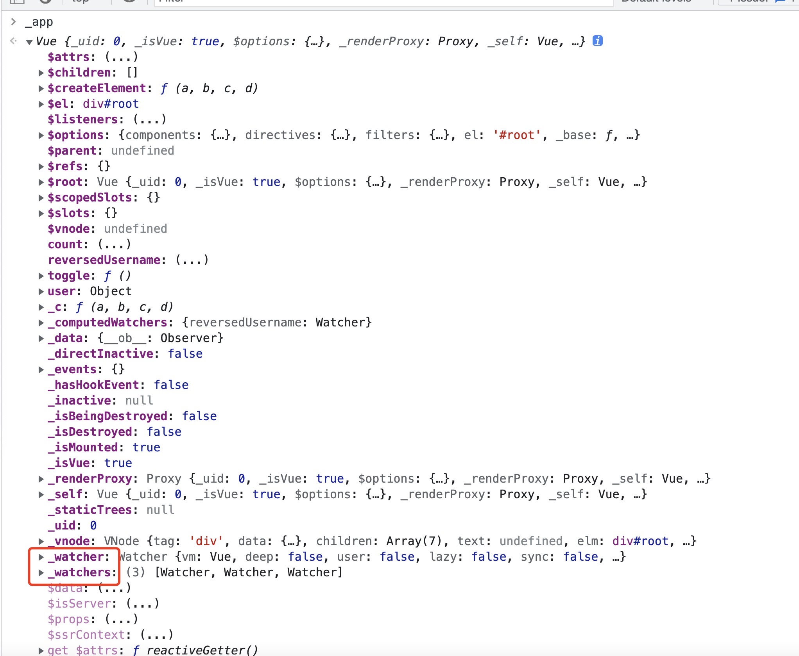
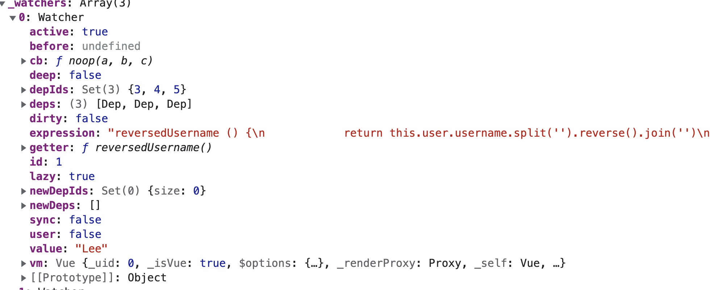
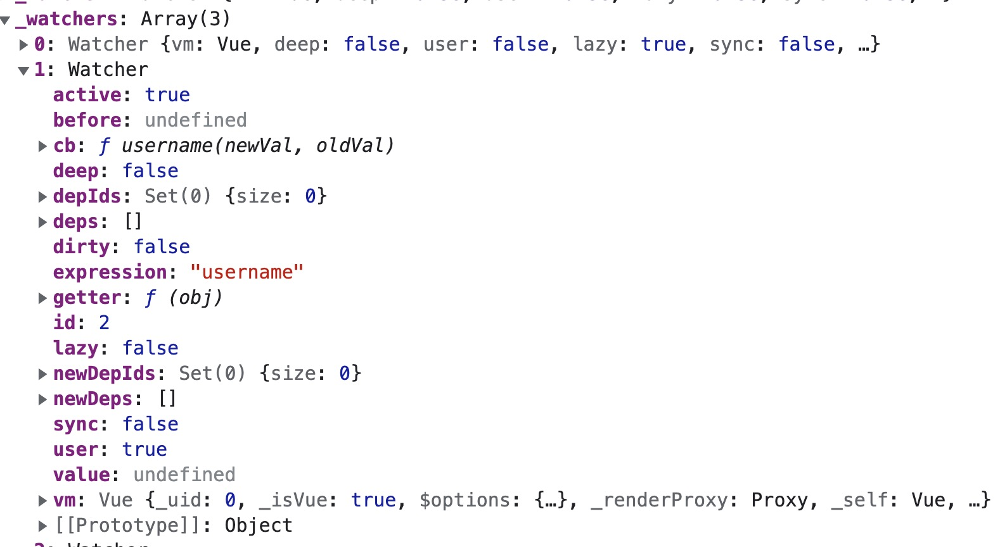
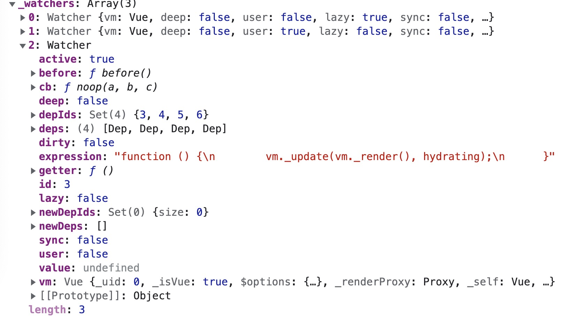

# 深入理解Vue计算属性与观察属性的区别

先看一段代码

```js
const initApp = () => {
  const app = new Vue({
    el: '#root',

    data: {
      user: {
        username: 'Lee'
      },
      count: 0
    },

    computed: {
      reversedUsername () {
        return this.user.username.split('').reverse().join('')
      }
    },

    watch: {
      username (newVal, oldVal) {
        if (newVal !== oldVal) {
          this.count += 1
        }
      }
    },

    methods: {
      toggle () {
        this.user.username = this.user.username.split('').reverse().join('')
      }
    }
  })

  window._app = app
}

window.addEventListener('load', initApp)
```

在浏览器中打印出 _app



_watcher 也是 Watcher 的实例, 不过是用于diff虚拟DOM 渲染真实DOM

_watchers 数组中存储了三个 watcher

分别是 

1. 计算Watcher



2. 观察Wacther



3. 渲染Watcher, 该wacher 就是上文中的 _watcher



我们先看

## 结论: 

### 相同点:
  1. 都是 Watcher 的实例
  2. 都是响应式的

## 原理: